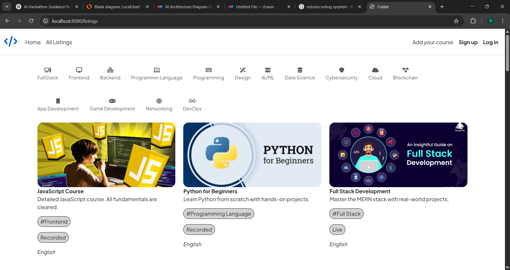
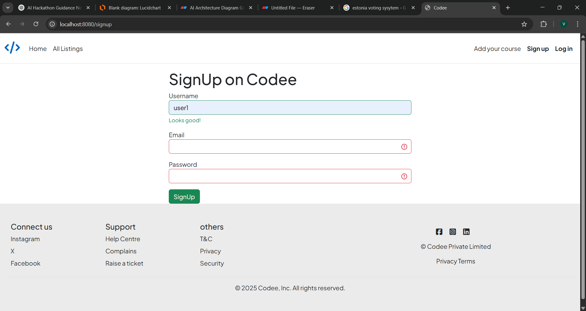

# PBL2
Repo for Project Based Learning 2

Title: Online Learning Platform

# LearnX – Online Learning Platform

LearnX is a full-stack web application designed for teachers to create and manage technology-related courses, and for students to explore and enroll in them. The platform focuses on providing a clean, responsive interface and essential learning features for both instructors and students.

## Features

- Instructor course creation and management
- Video upload support for recorded lectures
- Section to add notes and external resources
- Schedule live class links and timings
- Student reviews and star ratings for each course
- Filter courses by technology tags
- Responsive design for desktop and mobile

## Tech Stack

- **Frontend:** HTML, CSS, Bootstrap, EJS
- **Backend:** Node.js, Express.js
- **Database:** MongoDB
- **Templating Engine:** EJS

## Getting Started

### Prerequisites

- Node.js and npm installed
- MongoDB running locally or via Atlas

### Installation

```bash
git clone https://github.com/VinayakGawade009/PBL2.git
cd PBL2
npm install
npm start
```

## Screenshots

Here are some key pages and diagrams from the project:

### UI Pages
- **Home Page**  
  

- **Login Page**  
  

- **Sign Up Page**  
  

- **Course Page**  
  

- **Create Course Page**  
  

- **Edit Course Page**  
  

### Diagrams
- **Architecture Diagram**  
  

- **Flowchart 1**  
  

## Folder Structure

The project is organized as follows:
```
PBL2/
├── Controllers/ # Handles backend logic and route controllers
├── FrontEnd/ # Contains frontend components and assets
├── ScreenShots/ # Contains images and diagrams used in documentation
├── models/ # Mongoose schemas for MongoDB collections
├── views/ # EJS templates rendered on the frontend
├── public/ # Static files (CSS, JS, images)
├── routes/ # Express route definitions
├── app.js / server.js # Entry point for backend server
└── README.md # Project documentation
```
## Live Demo

Coming Soon.
